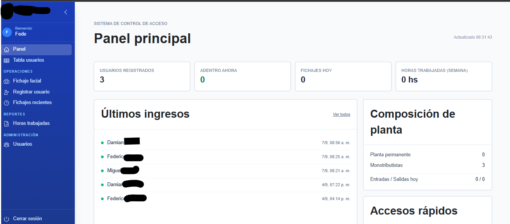
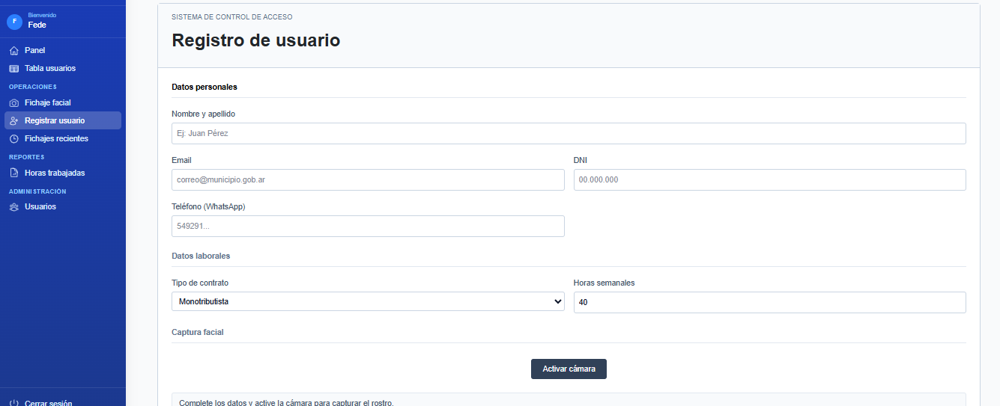
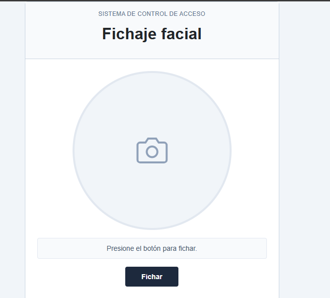
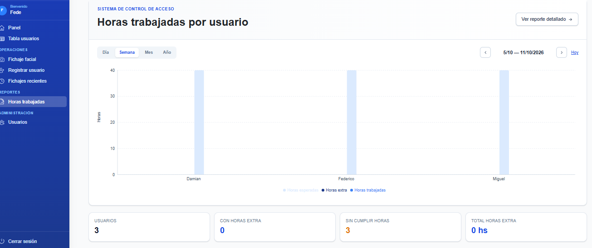

# FaceGate: Facial Recognition Access Control System

> Developed by **Federico Patrilla** — [Patrilla Comunicaciones](https://patrillacomunicaciones.com)

---

## Overview

An access control and attendance tracking system based on **facial recognition**, made up of a **web administration platform** and a **desktop client** that acts as the check-in terminal. The goal is to replace manual or card-based methods with fast, contactless identification that is hard to spoof.

## The Problem

Traditional check-in methods (paper sheets, cards, PINs) share common issues:

- **Buddy punching**: one employee can clock in for another.
- **Lost or forgotten** cards and credentials.
- **Administrative overhead**: consolidating records by hand is slow and error-prone.
- **No real-time visibility** into who is on site.

## The Solution

A two-component architecture:

1. **Check-in terminal (desktop)**: an application installed on a PC with a camera that detects a face, matches it against registered people and logs the check-in.
2. **Web dashboard**: people management, record lookup and overall system administration, accessible from any browser.

```
┌──────────────────────────┐          ┌──────────────────────────┐
│      Desktop client      │          │      Web dashboard       │
│     Python + PySide6     │  ─────►  │         Next.js          │
│                          │          │         (Vercel)         │
│  Camera → MediaPipe      │          │                          │
│  → ArcFace (ONNX)        │          │  People management       │
│  → Cosine similarity     │          │  Check-in records        │
└──────────────────────────┘          └──────────────────────────┘
```

## Screenshots

### Dashboard
Overview of the web panel showing system status and recent activity.



### Enrollment
Registering a new person and capturing their face to generate the reference embedding.



### Check-in
The desktop terminal identifying a person in real time and logging the check-in.



### Report
Entry and exit records filtered by person and time period.



## Facial Recognition Pipeline

Recognition runs in four stages:

1. **Capture**: the client grabs camera frames in real time.
2. **Detection and landmarks**: **MediaPipe Face Landmarker** detects the face and its landmarks, allowing the face to be cropped and aligned before processing.
3. **Embedding extraction**: the aligned face is fed into an **ArcFace** model (`w600k_mbf.onnx`, MobileFaceNet backbone) running on **ONNX Runtime**, producing a numeric vector (embedding) that represents the person's identity.
4. **Matching**: the embedding is compared against registered embeddings using **cosine similarity**. If the score exceeds a defined threshold, the person is identified and the check-in is recorded.

### Why these choices?

- **MediaPipe**: fast, lightweight detection that runs well on CPU, no GPU required.
- **ArcFace with MobileFaceNet**: high-accuracy recognition in a small footprint, ideal for ordinary office hardware.
- **ONNX**: a portable format that runs the model without depending on a heavy training framework.
- **Cosine similarity over embeddings**: adding a new person requires no retraining; storing their embedding is enough.

## Tech Stack

**Desktop client**
- Python
- PySide6 (Qt) for the GUI
- MediaPipe Face Landmarker for face detection
- ArcFace (`w600k_mbf.onnx`) + ONNX Runtime for embeddings
- NumPy for similarity computation
- PyInstaller to package the app as a Windows `.exe`

**Web platform**
- Next.js
- Vercel (deployment)

## Challenges and Lessons Learned

- **Performance on modest hardware**: choosing lightweight models (MediaPipe + MobileFaceNet) enables real-time recognition without a GPU.
- **Tuning the similarity threshold**: too low causes false positives, too high rejects registered people; getting it right is key to the user experience.
- **Client distribution**: packaging a project with ONNX models and MediaPipe dependencies via PyInstaller requires correctly bundling model files and resources inside the executable.
- **Separation of concerns**: biometric processing happens on the local terminal, while the web side focuses on administration and reporting.

## Results

- **Contactless** check-in with no physical credentials.
- Reduced risk of **buddy punching**.
- Centralized records accessible from the web.
- Simple terminal installation through a single executable.

## Next Steps

- Liveness detection to prevent check-ins using photos or videos.
- Support for multiple synchronized terminals.

---

## Contact

**Federico Patrilla** — Custom software development
🌐 [patrillacomunicaciones.com](https://patrillacomunicaciones.com)
📍 General Pico, La Pampa, Argentina
